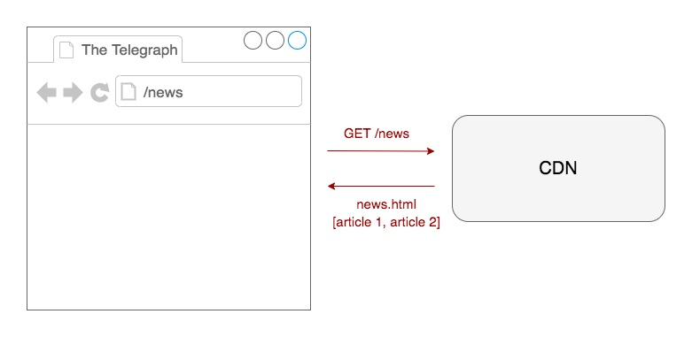

# Nuxt/Vue

## Introduction

Vue is a widely adopted open-source JavaScript framework with strong community support. It's ecosystem includes [Vuex](https://vuex.vuejs.org/) (state management) and [Vue-Router](https://router.vuejs.org/) (routing) and [Nuxt](https://nuxtjs.org/) (server-side rendering and static rendering).

## Objectives

Explore server-side rendering, client side rendering static rendering using the Vue ecosystem. I will predominantly be looking at its:

- Scalability
- Maintainability
- Performance
- Configurability

## POC

- Project repo: [https://github.com/chrisboakes/nuxt-vue-demo](https://github.com/chrisboakes/nuxt-vue-demo)
- Built project: 

I used the [create-nuxt-app](https://github.com/nuxt/create-nuxt-app) scaffolding tool to prototype this POC and used some dummy data to imitate the content API.

This POC is a mixture of statically generated, server-side rendered and client side rendered data:

- [Static rendering](#Static-Rendering): the home page
- [Server-side rendering](#Server-Side-Rendering): the politics page and the politics articles
- [Client-side rendering](#Client-Side-Rendering): the news page and the news articles

## Outcome

### Pros

- Intuitive component driven architecture and easy to develop with
- Simple switch between client-side and server-side rendering (`fetchOnServer: true`)
- Nice separation of HTML, CSS and JavaScript (not writing HTML in JS)
- Data binding support
- Can configure different server-side frameworks (nuxt default server, express, fastify etc.)
- Strong community support - well documented and easy to find answers online

### Cons

- Overhead of loading a framework
- Lack of internal knowledge
- Cannot seem to separate static and server-side rendering cleanly

## Further research

- Route highlighting 
- Service workers
- pre-fetching
- Offline
- DOM hyrdation

## Resources

- [Vue Docs](https://vuejs.org/v2/guide/)
- [Nuxt Docs](https://nuxtjs.org/)

## Rendering Types

[This article](https://developers.google.com/web/updates/2019/02/rendering-on-the-web) gives an overview of the different rendering types.

### Server-Side Rendering

The request is made to the server which makes a call to the Content API, once it has a response it returns the data to the server and the server returns the HTML to the browser.


### Client-Side Rendering

The intial request for HTML is made to the CDN which returns HTML without any content. After the HTML has been rendered by the browser a call is made via JavaScript to fetch the content from the content API which is then appended into the markup.


### Static Rendering

Before the application is deployed, when the project is being compiled, all of the requests to the content API are made and compiled to HTML files which can served back quickly from a CDN.



# Running the project

## Build Setup

```bash
# install dependencies
$ npm install

# serve with hot reload at localhost:3000
$ npm run dev

# build for production and launch server
$ npm run build
$ npm run start
```

For detailed explanation on how things work, check out [Nuxt.js docs](https://nuxtjs.org).
